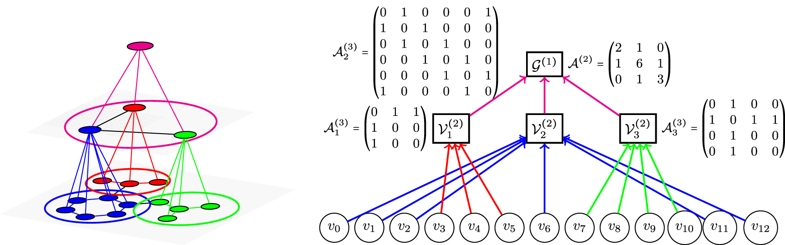

# Higher-order Permutation-equivariant Graph Variatonal Autoencoder



Our paper:
* https://iopscience.iop.org/article/10.1088/2632-2153/acc0d8
* https://arxiv.org/pdf/2106.00967.pdf

Original codebase:
https://github.com/HyTruongSon/MGVAE

## Contributors

* Ngo Nhat Khang
* Hy Truong Son (PI / Correspondent)

## Please cite our work!

```bibtex
@article{Hy_2023,
doi = {10.1088/2632-2153/acc0d8},
url = {https://dx.doi.org/10.1088/2632-2153/acc0d8},
year = {2023},
month = {mar},
publisher = {IOP Publishing},
volume = {4},
number = {1},
pages = {015031},
author = {Hy, Truong Son and Kondor, Risi},
title = {Multiresolution equivariant graph variational autoencoder},
journal = {Machine Learning: Science and Technology},
abstract = {In this paper, we propose Multiresolution Equivariant Graph Variational Autoencoders (MGVAE), the first hierarchical generative model to learn and generate graphs in a multiresolution and equivariant manner. At each resolution level, MGVAE employs higher order message passing to encode the graph while learning to partition it into mutually exclusive clusters and coarsening into a lower resolution that eventually creates a hierarchy of latent distributions. MGVAE then constructs a hierarchical generative model to variationally decode into a hierarchy of coarsened graphs. Importantly, our proposed framework is end-to-end permutation equivariant with respect to node ordering. MGVAE achieves competitive results with several generative tasks including general graph generation, molecular generation, unsupervised molecular representation learning to predict molecular properties, link prediction on citation graphs, and graph-based image generation. Our implementation is available at https://github.com/HyTruongSon/MGVAE.}
}
```
